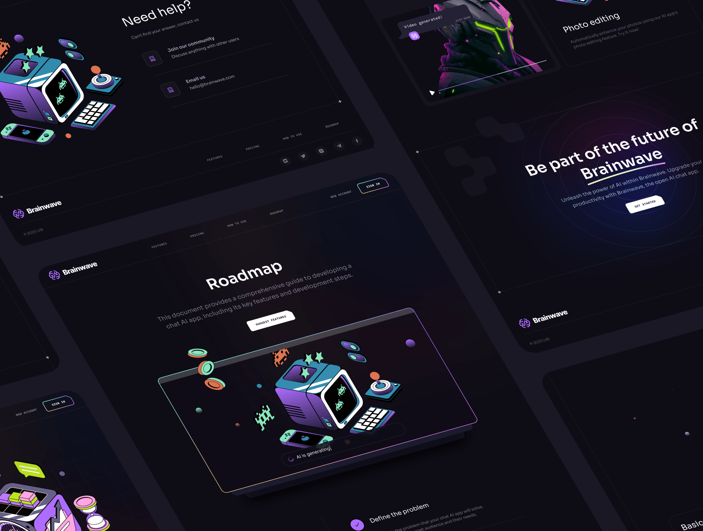

# Brainwave – AI Chat UI Concept ✨🧠

A modern and sleek front-end concept for an AI chat platform, inspired by real-world applications like ChatGPT. Built using React and Tailwind CSS, Brainwave showcases smooth UI components, mobile responsiveness, and elegant scrolling animations.

## 🚀 Live Demo

Check it out here 👉 [Brainwave](https://brainwave-sigma-ten.vercel.app)

## 📸 Screenshots


---

## 🛠️ Tech Stack

- **React.js** – UI development
- **Tailwind CSS** – Utility-first styling
- **React Scroll Lock** – Improved scroll behavior

---

## 📂 Features

- 📱 Responsive design (mobile/tablet/desktop)
- 🧠 Clean layout for AI conversation flow
- 🌙 Dark-themed UI with smooth transitions
- 🔒 Scroll lock integration for chat container
- 💡 Developer-friendly folder structure

---

## 🧑‍💻 Getting Started

```bash
# Clone the repo
git clone https://github.com/hilla10/brainwave.git

# Navigate into the directory
cd brainwave

# Install dependencies
npm install

# Start the development server
npm run dev
```

🙌 Author
 - Hailemichael Negusse
 - 📧 hillaman592@gmail.com
 - 🔗 GitHub – hilla10
 - 🌍 Addis Ababa, Ethiopia

📄 License
This project is for educational and portfolio purposes. Feel free to fork or use the design for learning.

🌟 Credits
Inspired by modern AI UI trends

Thanks to Tailwind, Vercel, React communities, and JavascriptMatery 
